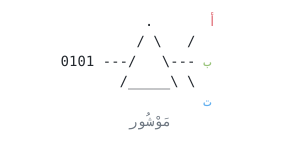
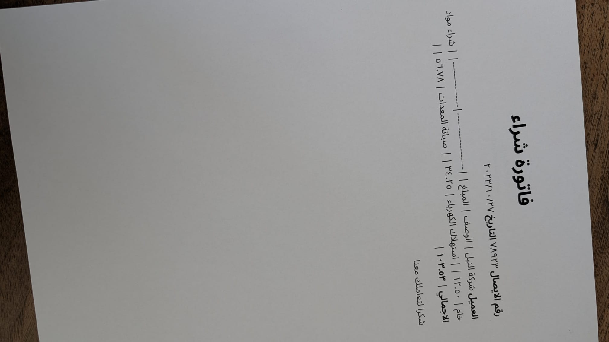
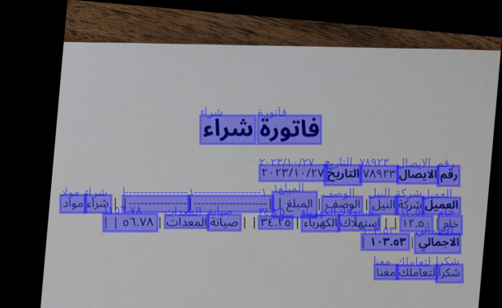

<p align="center">
  
</p>

# mawshor

Arabic OCR pipeline built on [OnnxTR](https://github.com/felixdittrich92/OnnxTR) with fine-tuned ONNX models.

<table align="center">
  <tr>
    <td align="center"><br><em>Sample Input Image</em></td>
    <td align="center"><br><em>Model Prediction Output</em></td>
  </tr>
</table>

## Features

- **Arabic-first STR**: recognition model fine-tuned on Arabic script.
- **Orientation correction**: detects and corrects both page-level rotation and crop-level skew before inference (`--straighten-pages`)
- **LLM postprocessing**: low-confidence OCR words are sent to any OpenAI-compatible LLM for context-aware correction (`--postprocess`)
- **GPU-accelerated**: runs on CUDA via ONNX Runtime; CPU fallback available

## Models

Four fine-turned Arabic models are loaded from HuggingFace (`madskills/`):

| Model | Architecture | Task |
|---|---|---|
| `onnxtr-fast_base-arabic` | FAST | Text detection |
| `onnxtr-parseq-arabic` | PARSeq | Text recognition |
| `onnxtr-mobilenet_v3_small-crop-orientation-arabic` | MobileNet V3 Small | Crop orientation correction |
| `onnxtr-mobilenet_v3_small-page-orientation-arabic` | MobileNet V3 Small | Page orientation correction |

Models were fine-tuned on synthetic Arabic datasets using DocTR's models as a base. 

## Requirements

- Python 3.10+
- CUDA-capable GPU (CPU fallback available but not the primary target)

```
pip install -r requirements.txt
```

## Usage

```bash
python core.py <path> [options]
```

`<path>` can be a single image/PDF or a directory. Supported image formats: PNG, JPG, JPEG, BMP, TIFF.

### Options

| Flag | Short | Description |
|---|---|---|
| `--straighten-pages` | `-s` | Detect and correct page/crop orientation before OCR |
| `--postprocess` | `-p` | Send low-confidence words to an LLM for correction |
| `--save` | | Save output to a `.txt` file next to each input file |
| `--raw-output` | `-r` | Print the raw predictor output |
| `--llm-endpoint` | | OpenAI-compatible API base URL (default: `http://localhost:11434/v1`) |
| `--llm-model` | | Model name for postprocessing (default: `qwen3.5:4b`) |
| `--llm-api-key` | | API key (default: `ollama`) |

### Examples

```bash
# Basic OCR on a single image
python core.py document.jpg

# OCR a directory and save results
python core.py ./scans/ --save

# OCR with page straightening and LLM postprocessing via local Ollama
python core.py document.jpg --straighten-pages --postprocess

# Use a different model or remote endpoint
python core.py document.jpg --postprocess \
  --llm-endpoint https://api.openai.com/v1 \
  --llm-model gpt-4o \
  --llm-api-key sk-...
```

## Postprocessing

When `--postprocess` is enabled, OCR output is filtered by confidence and sent to an LLM:

- Words with confidence ≥ 0.8 are passed as-is
- Words with confidence between 0.75–0.8 are passed and flagged as low-confidence
- Words with confidence < 0.75 are dropped before sending

The LLM is prompted as an Arabic copyeditor to fix likely OCR errors, merge/split words, and clean up spacing: without changing meaning or adding content.

Any OpenAI-compatible endpoint works. [Ollama](https://ollama.com) runs out of the box with the defaults.
